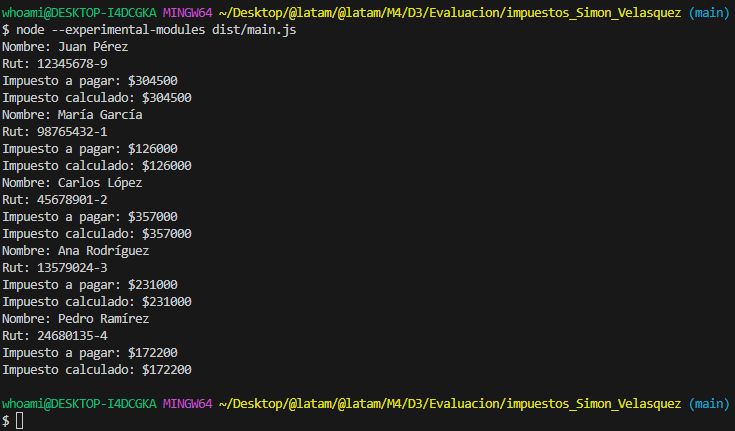

# impuestos_Simon_Velasquez

#git clone : https://github.com/siseveca79/impuestos_Simon_Velasquez

1. mkdir .\babel.config.json y mkdir dist
2. npm install @babel/cli @babel/preset-env --save-dev
3. npx babel src --out-dir dist --copy-files
4. node --experimental-modules dist/main.js

